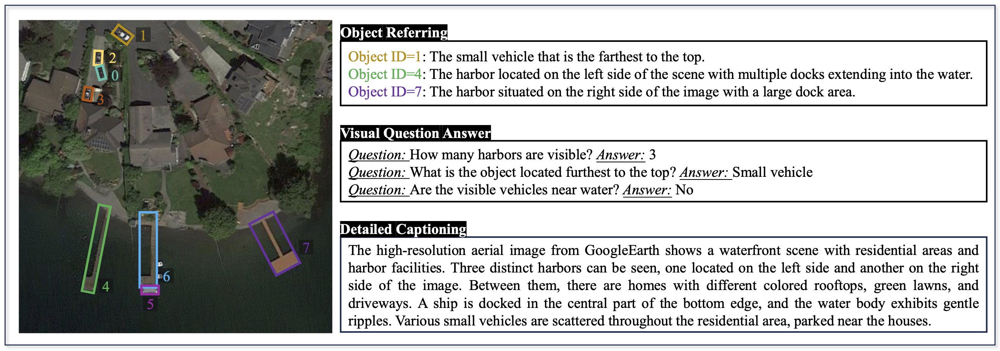

<font size='5'>**VRSBench: A Versatile Vision-Language Benchmark Dataset for Remote Sensing Image Understanding**</font>

Xiang Li, Jian Ding, Mohamed Elhoseiny

<a href='https://vrsbench.github.io'></a> <a href='https://arxiv.org/abs/2406.12384'></a>  <a href='https://huggingface.co/datasets/xiang709/VRSBench'>

# VRSBench
<center>
    
</center>

VRSBench is a Versatile Vision-Language Benchmark for Remote Sensing Image Understanding. It consists of 29,614 remote sensing images with detailed captions, 52,472 object refers, and 3123,221 visual question-answer pairs. It facilitates the training and evaluation of vision-language models across a broad spectrum of remote sensing image understanding tasks. 

## Using `datasets`

The dataset can be downloaded from [link](https://huggingface.co/datasets/xiang709/VRSBench) and used via the Hugging Face `datasets` library. To load the dataset, you can use the following code snippet:

```python
from datasets import load_dataset
fw = load_dataset("xiang709/VRSBench", streaming=True)
```

## Dataset curation
To construct our VRSBench dataset, we employed multiple data engineering steps, including attribute
extraction, prompting engineering, GPT-4 inference, and human verification. 

- Attribute Extraction: we extract image information, including the source and resolution, as well as object information—such as the object category, bounding box, color, position (absolute and relative), and size (absolute and relative)—from existing object detection datasets. Please check ```extract_patch_json.py``` for attribute extraction details.
- Prompting Engineering: We carefully design instructions to prompt GPT-4V to create detailed image captions, object referring, and question-answer pairs. Please check ```instruction.txt``` for detialed instruction.
- GPT-4 inference: Given input prompts, we call OpenAI API to automatically generate image captions, object referring, and question-answer pairs based on the prompts. Use the ```extract_patch_json.py``` to get initial annotations for image captioning, visual grounding, and VQA tasks using GPT-4V.
- Human verification: To improve the quality of the dataset, we engage human annotators to validate each annotation generated by GPT-4V.


## Model Training
For the above three tasks, we benchmark state-of-the-art models, including [LLaVA-1.5](https://github.com/haotian-liu/LLaVA), [MiniGPT-v2](https://github.com/Vision-CAIR/MiniGPT-4), [Mini-Gemini](https://github.com/dvlab-research/MGM), and [GeoChat](https://github.com/mbzuai-oryx/GeoChat), to demonstrate the potential of LVMs for remote sensing image understanding. To ensure a fair comparison, we reload the models that are initially trained on large-scale image-text alignment datasets, and then finetune each method using the training set of our RSVBench dataset. For each comparing method, we finetune the model on the training set of our RSVBench dataset for 5 epochs. Following GeoChat, we use LoRA finetuning to finetune all comparing methods, with a rank of 64. 

Use the ```prepare_geochat_eval_all.ipynb``` to prepare the VRSBench evaluation file for image captioning, visual grounding, and VQA tasks.

## Benchmark Results
### Image Captioning Results

| Method                   | BLEU-1 | BLEU-2 | BLEU-3 | BLEU-4 | METEOR | ROUGE_L | CIDEr | Avg_L |
|--------------------------|--------|--------|--------|--------|--------|---------|-------|-------|
| GeoChat w/o ft       | 13.9   | 6.6    | 3.0    | 1.4    | 7.8    | 13.2    | 0.4   | 36    |
| GPT-4V               | 37.2   | 22.5   | 13.7   | 8.6    | 20.9   | 30.1    | 19.1  | 67    |
| MiniGPT-v2           | 36.8   | 22.4   | 13.9   | 8.7    | 17.1   | 30.8    | 21.4  | 37    |
| LLaVA-1.5            | **48.1** | **31.5** | **21.2** | **14.7** | **21.9** | **36.9** | **33.9** | 49    |
| GeoChat              | 46.7   | 30.2   | 20.1   | 13.8   | 21.1   | 35.2    | 28.2  | 52    |
Mini-Gemini     | 47.6   | 31.1   | 20.9   | 14.3   | 21.5   | 36.8    | 33.5  | 47    |

**Caption**: Detailed image caption performance on the VRSBench dataset. Avg\_L denotes the average word length of generated captions.

### Object Referring Results

| Method                        | Unique       |          | Non Unique  |          | All       |          |
|-------------------------------|--------------|----------|-------------|----------|-----------|----------|
|                               | Acc@0.5      | Acc@0.7  | Acc@0.5     | Acc@0.7  | Acc@0.5   | Acc@0.7  |
| GeoChat w/o ft      | 20.7             | 5.4    | 7.3              | 1.7    | 12.9              | 3.2    |
| GPT-4V                  | 8.6              | 2.2    | 2.5              | 0.4    | 5.1               | 1.1    |
| MiniGPT-v2          | 40.7             | 18.9   | **32.4**         | **15.2** | 35.8             | 16.8   |
| LLaVA-1.5           | 54.8             | 28.7   | 23.1             | 7.0    | 36.3              | 16.0   |
| GeoChat             | **55.1**         | **31.2** | 28.5           | 10.1   | **39.6**          | **19.1** |
| Mini-Gemini         | 45.2             | 19.4   | 17.4             | 4.6    | 29.0              | 10.8   |

**Caption**: Visual grounding performance on the VRSBench dataset. 

| Method                  | Category | Presence | Quantity | Color | Shape | Size | Position | Direction | Scene | Reasoning | Avg.  |
|-------------------------|----------|----------|----------|-------|-------|------|----------|-----------|-------|-----------|-------|
| # VQAs                  | 5435     | 7789     | 6374     | 3550  | 1422  | 1011 | 5829     | 477       | 4620  | 902       |       |
| GeoChat w/o ft      | 48.5     | 85.9     | 19.2     | 17.0  | 18.3  | 32.0 | 43.4     | 42.1      | 44.2  | 57.4      | 40.8  |
| GPT-4V                  | 67.0     | 87.6     | 45.6     | 71.0  | 70.8  | 54.3 | 67.2     | 50.7      | 69.8  | 72.4      | 65.6  |
| MiniGPT-v2          | 46.2     | 74.1     | 47.3     | 44.4  | 28.6  | 17.2 | 23.3     | 15.3      | 38.7  | 36.3      | 37.1  |
| LLaVA-1.5           | **62.8** | 89.2     | **50.4** | **57.8** | 58.5 | **52.3** | 56.9     | **50.7** | **66.0** | **64.9** | **60.9** |
| GeoChat             | 60.4     | **89.9** | 47.5     | 58.7  | **59.1** | **52.3** | **57.0** | 50.3      | 66.1  | **64.9** | 60.6  |
| Mini-Gemini         | 58.7     | 89.4     | 50.0     | 57.9  | 57.9  | 53.7 | 54.8     | 50.1      | 65.0  | 64.3      | 60.2  |

**Caption**: Visual question answering performance on the {\papernameAbbrev} dataset. Rows in bold indicate newly added results.


### Visual Question Answering Results

## Licensing Information
The dataset is released under the [Creative Commons Attribution Non Commercial 4.0](https://creativecommons.org/licenses/by-nc/4.0/deed.en), which permits unrestricted use, distribution, and reproduction in any medium, provided the original work is properly cited.

## 📜 Citation

```bibtex
@misc{li2024vrsbench,
      title={VRSBench: A Versatile Vision-Language Benchmark Dataset for Remote Sensing Image Understanding}, 
      author={Xiang Li, Jian Ding, Mohamed Elhoseiny},
      year={2024},
      eprint={xxx},
      archivePrefix={arXiv},
      primaryClass={cs.CV}
}  
```

## 🙏 Acknowledgement
Our VRSBench dataset is built based on [DOTA-v2](https://captain-whu.github.io/DOTA/dataset.html) and [DIOR](https://gcheng-nwpu.github.io/#Datasets) datasets.

We are thankful to [LLaVA-1.5](https://github.com/haotian-liu/LLaVA), [MiniGPT-v2](https://github.com/Vision-CAIR/MiniGPT-4), [Mini-Gemini](https://github.com/dvlab-research/MGM), and [GeoChat](https://github.com/mbzuai-oryx/GeoChat) for releasing their models and code as open-source contributions.

